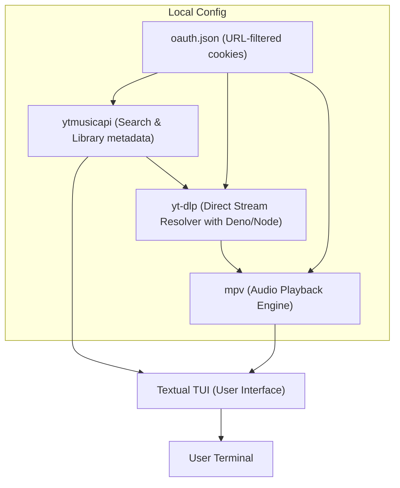

<h1 align="center">
  🎵 ytune
</h1>

<p align="center">
  <strong>A premium, modern terminal YouTube Music player for Linux.</strong><br/>
  Inspired by <code>rmpc</code>, featuring rich ASCII album art, robust browser session synchronization, and vim-style navigation.
</p>

<p align="center">
  <a href="https://www.python.org/"></a>
  <a href="https://textual.textualize.io/"></a>
  <a href="https://mpv.io/"></a>
  <a href="https://git-scm.com/"></a>
  
</p>

---

## ✨ Features

- 🔍 **Direct Search**: Instant lookup of tracks, playlists, and albums directly from YouTube Music.
- 📚 **Library & Playlists**: Browse your personal playlists and Liked Songs natively in the terminal.
- 🎨 **ASCII Album Art**: Live-rendered thumbnails as beautiful Unicode block art directly in the sidebar.
- 🔒 **Secure Auto-Login**: Headed Chromium sync that securely captures session tokens (`__Secure-3PAPISID` and `__Secure-3PSIDTS`) with 1P/3P cookie safety.
- ⚡ **Resilient Playback**:
  - Direct stream extraction via `yt-dlp` using automatic `deno`-based JS challenge solving (no throttled streams or `403` errors).
  - Dynamic fallback to resolve public stream URLs without cookies if credentials expire.
  - Auto-skip to the next track on any unexpected resolution error.
- ⌨️ **Vim-Style Navigation**: Smooth mouse and keyboard navigation with standard bindings.
- 🌙 **Modern Design**: Responsive grid layout with a vibrant violet/purple color palette.

---

## 📸 Interface Preview

```
  ┌────────────────────────────────────────────────────────┐
  │  ♫ Queue    🔍 Search    📚 Library                    │
  ├────────────────────────────────────────────────────────┤
  │  #   Title                  Artist         Album       │
  │  ────────────────────────────────────────────────────  │
  │  1   Never Gonna Give You.. Rick Astley    Whenever..  │
  │                                                        │
  │                                                        │
  │                                                        │
  ├────────────────────────────────────────────────────────┤
  │  ■ Play [0:14 / 3:32]  Vol: 75%  🔀 Shuffle  🔁 Repeat │
  └────────────────────────────────────────────────────────┘
```

---

## 🛠️ System Requirements

### 1. System Dependencies
`ytune` requires `mpv` (including `libmpv`) and a JavaScript runtime (`deno` or `node`) for decoding signatures.

* **Arch Linux**:
  ```bash
  sudo pacman -S mpv deno
  ```
* **Ubuntu / Debian**:
  ```bash
  sudo apt update
  ```
  ```bash
  sudo apt install mpv libmpv-dev nodejs
  ```
* **Fedora**:
  ```bash
  sudo dnf install mpv mpv-libs-devel nodejs
  ```

### 2. Python Environment
Make sure you are running Python 3.8 or newer.

---

## 🚀 Installation

### Automated Installation (Recommended)
Simply clone this repository and run the automated installer:

```bash
git clone https://github.com/<your-username>/ytune.git
cd ytune
chmod +x install.sh
./install.sh
```

The installer will automatically:
1. Detect and guide you to install system dependencies (`mpv`, `deno`/`node`).
2. Create and set up a Python virtual environment.
3. Install Python dependencies and Playwright browser engines.
4. Create a symlink `~/.local/bin/ytune` to allow running the app from anywhere.

> [!NOTE]
> Make sure `~/.local/bin` is in your `PATH` environment variable. If not, add `export PATH="$HOME/.local/bin:$PATH"` to your `~/.bashrc` or `~/.zshrc`.

### Manual Installation (Alternative)
If you prefer to set up ytune manually:
1. Create and activate a virtual environment:
   ```bash
   python -m venv .venv
   source .venv/bin/activate
   ```
2. Install the package in editable mode:
   ```bash
   pip install -e .
   ```
3. Set up Playwright Chromium:
   ```bash
   python -m playwright install chromium
   ```

---

## 📖 Usage

### Connect to YouTube Music (Authentication)
Before starting the player, connect your library:
```bash
ytune auth
```
1. Select **Option 1 (Browser Auto Login)**.
2. Sign in to your Google/YouTube Music account in the Chromium window that opens.
3. The script will automatically capture the session tokens, save them to `~/.config/ytune/oauth.json`, and close.

### Launch Player
To start the TUI player, run:
```bash
ytune
```

---

## ⌨️ Keyboard Shortcuts

| Key | Action | Category |
|:---|:---|:---|
| `space` | Play / Pause | Playback |
| `n` | Next Track | Playback |
| `p` | Previous Track | Playback |
| `s` | Stop Playback | Playback |
| `←` / `→` | Seek −5s / +5s | Playback |
| `+` / `-` | Volume Up / Down | Playback |
| `r` | Cycle Repeat Mode (off → all → one) | Playback |
| `z` | Toggle Shuffle | Playback |
| `/` | Focus Search Input | Navigation |
| `Tab` | Switch between Tabs | Navigation |
| `a` | Add selected track to Queue | Queue |
| `d` | Remove selected track from Queue | Queue |
| `q` | Quit Player | General |

---

## 📐 Architecture Diagram



---

## ⚖️ License

Distributed under the MIT License. See `LICENSE` for more information.
